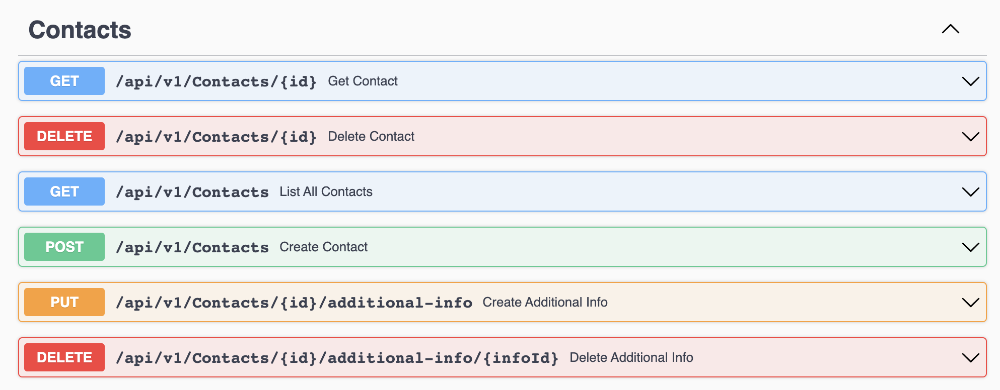
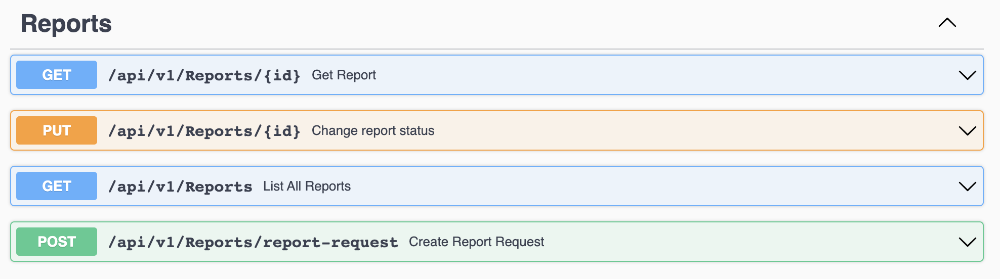
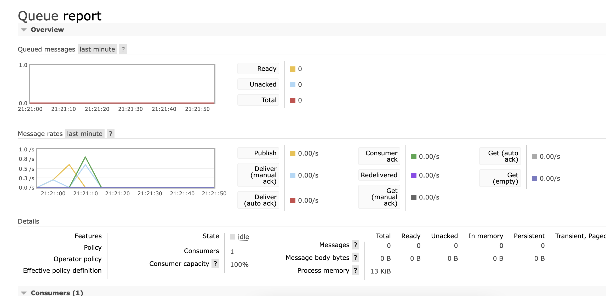

# Contact Manager #

> This project is developed to simulate a workflow of a small Contact Manager.
> The project has an api which allows users to make CRUD operations for Contact Domain object.
> The api also has an endpoint to list and download any report that produced bt the worker.

## Technical Stack & Patterns
- .Net 6
- CQRS
- Mediator
- RabbitMQ
- MongoDb
- Fluent Validation (CQRS pipeline)
- Multilayered architecture
- Domain Driven Design - Development (DDD)
- Repository pattern
- Serilog (request logging enabled)

## Running the project
To run project, you need to have .net 6 SDK on your local machine. You also need to have docker desktop.
Then, in the project path, you need to restore nuget packages

- Restore packages by this command
 
`dotnet restore`
- Run the api by this command:

`dotnet run --project ./src/Contacts.Api/Contacts.Api.csproj`

- Run the worker by this command:

`dotnet run --project src/Reports.Worker/Reports.Worker.csproj`

### ContactManager.Api
 The api has such endpoints to manipulate the business objects:
 
http://localhost:5000

> You can manage contacts domain with this endpoints.

 

> You can also download and request another report by this commands

 

### Reports.Worker

> The worker subscribes to the RabbitMQ service to consume events. Api creates an event then the worker handles these events.
> 
> The server is running on that url by default:
> http://localhost:6000

### RabbitMQ 
You can watch the queue status with the default url: http://localhost:15672/
- Username: contacts_queue_user
- Password: S3cret

